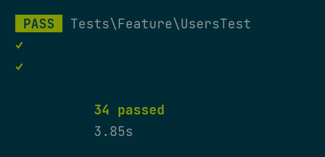
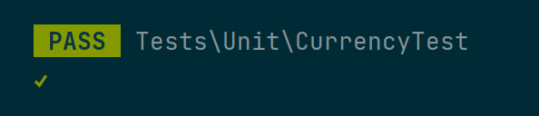
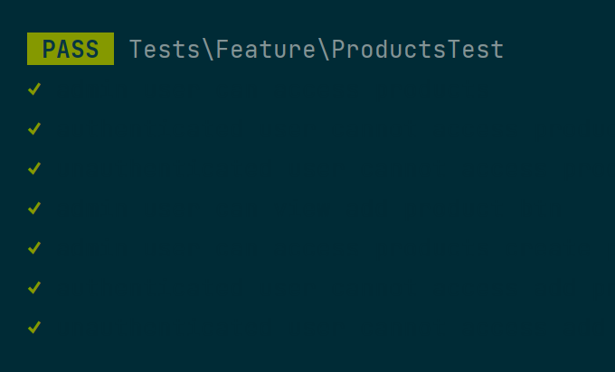

# Testing Assignment

## User Story 1
**Analysis**
- User Story:
  - As a user I want to be able to view a list of all users of the site so that I can see who uses the site.
- Happy Path:
  - **Given** User is logged in
  - **When** Accessing the users page
  - **Then** The user and all other users are visible.
- Sad Path:
  - **Given** User is a guest(account-less)
  - **When** User goes to the users page
  - **Then** The user is unable to access the page.
    - **And** The user is redirected to log in.

**Design**
- The users page displays a list of all users.
- The users page can only be accessed by authenticated users.
- The users page displays stats regarding the users, like total count.

**Testing**
- **System Tests**
  - *Happy Path*
    - Checks if the users page is accessible by a user, if the user’s name is displayed on the page, as well if the total user count is displayed.
  - *Sad Path*
    - It tests to see if the middleware is functioning properly, like in the event a user is not logged in and as such should not see the users page and instead be redirected to the login page.
- **Unit Tests**
  - Verifies if the total user count is correctly calculated.
- **Comments**
  - Why some parts are not tested
    - We don't test if the user is an admin because they can see the page by default for being authenticated. We also don't check if the users list is displayed correctly beyond the accuracy of information, like with multiple users instead of one. This can be considered unneeded in a way because it does not determine the base functionality as working.

**Completed Tests**

**Evaluation**
- The test is able to check if the users page is accessible by authenticated users as well as if it displays accurate information.
- The test does not check if more than one user can be displayed.
- We can conclude that the tests ensure the, only accessible to users, user list is functioning and viewable. The tests only cover the default uses of the user story.
- Improvement: 
  - The system test checks to see if the user is redirected and to the login page, but in the event that logic changes the test would not be able to cover it. It would be improvement to cover this issue. Another improvement would be to test the pagination of the list.

## User Story 2
**Analysis**
- User Story:
    - As an admin user I want to be able to view and add new products so that I can more easily see all of my product data.
- Happy Path:
    - **Given** User is logged in as an admin
    - **When** Accessing the products page
    - **Then** Products and the New Product button are visible on the page.
- Sad Path:
    - **Given** User is logged in as a default user.
    - **When** User goes to the products page
    - **Then** The user is unable to access the page.
        - **And** The user is redirected to dashboard.

**Design**
- The products page displays multiple products.
- The products page can only be accessed by admin users.
- The products page shows each product's details, like price and quantity.

**Testing**
- **System Tests**
    - *Happy Path*
        - Checks if the products page is accessible and only by admins, as well as if the create new product button and page are accessible.
    - *Sad Path*
        - It tests to see if the middleware is functioning properly, like in the event a user is not logged in and as such should not see the products index, show, nor create pages and instead be redirected to the dashboard page, or login page in the case of unauthenticated users.
- **Unit Tests**
    - Verifies whether the USD to EUR conversion for the products are ‘correct’.
- **Comments**
    - Why some parts are not tested
        - We don't test if the admin user, when creating a new product, whether they are actually able to create a new product, not just view the create form, because we can assume it functions when the create form page doesn't error.

**Completed Tests**

**Evaluation**
- The test is able to check if the products page is accessible only by admin users as well as if it displays accurate information.
- The test does not check if adding new products works beyond the create page.
- We can conclude that the tests ensure the, only accessible to admins, product page is viewable and that the creation flow is accessible. The tests only mostly cover the default uses of the user story.
- Improvement:
    - The system test checks to see if the user is an admin or else redirected to the login page, but in the event that logic changes the test would not be able to cover it. It would be improvement to cover this issue. Additional improvement would be testing that product creation actually functions.

## About Laravel

Laravel is a web application framework with expressive, elegant syntax. We believe development must be an enjoyable and creative experience to be truly fulfilling. Laravel takes the pain out of development by easing common tasks used in many web projects, such as:

- [Simple, fast routing engine](https://laravel.com/docs/routing).
- [Powerful dependency injection container](https://laravel.com/docs/container).
- Multiple back-ends for [session](https://laravel.com/docs/session) and [cache](https://laravel.com/docs/cache) storage.
- Expressive, intuitive [database ORM](https://laravel.com/docs/eloquent).
- Database agnostic [schema migrations](https://laravel.com/docs/migrations).
- [Robust background job processing](https://laravel.com/docs/queues).
- [Real-time event broadcasting](https://laravel.com/docs/broadcasting).

Laravel is accessible, powerful, and provides tools required for large, robust applications.

## Learning Laravel

Laravel has the most extensive and thorough [documentation](https://laravel.com/docs) and video tutorial library of all modern web application frameworks, making it a breeze to get started with the framework.

You may also try the [Laravel Bootcamp](https://bootcamp.laravel.com), where you will be guided through building a modern Laravel application from scratch.

If you don't feel like reading, [Laracasts](https://laracasts.com) can help. Laracasts contains over 2000 video tutorials on a range of topics including Laravel, modern PHP, unit testing, and JavaScript. Boost your skills by digging into our comprehensive video library.

## Laravel Sponsors

We would like to extend our thanks to the following sponsors for funding Laravel development. If you are interested in becoming a sponsor, please visit the Laravel [Patreon page](https://patreon.com/taylorotwell).

### Premium Partners

- **[Vehikl](https://vehikl.com/)**
- **[Tighten Co.](https://tighten.co)**
- **[Kirschbaum Development Group](https://kirschbaumdevelopment.com)**
- **[64 Robots](https://64robots.com)**
- **[Cubet Techno Labs](https://cubettech.com)**
- **[Cyber-Duck](https://cyber-duck.co.uk)**
- **[Many](https://www.many.co.uk)**
- **[Webdock, Fast VPS Hosting](https://www.webdock.io/en)**
- **[DevSquad](https://devsquad.com)**
- **[Curotec](https://www.curotec.com/services/technologies/laravel/)**
- **[OP.GG](https://op.gg)**
- **[WebReinvent](https://webreinvent.com/?utm_source=laravel&utm_medium=github&utm_campaign=patreon-sponsors)**
- **[Lendio](https://lendio.com)**

## Contributing

Thank you for considering contributing to the Laravel framework! The contribution guide can be found in the [Laravel documentation](https://laravel.com/docs/contributions).

## Code of Conduct

In order to ensure that the Laravel community is welcoming to all, please review and abide by the [Code of Conduct](https://laravel.com/docs/contributions#code-of-conduct).

## Security Vulnerabilities

If you discover a security vulnerability within Laravel, please send an e-mail to Taylor Otwell via [taylor@laravel.com](mailto:taylor@laravel.com). All security vulnerabilities will be promptly addressed.

## License

The Laravel framework is open-sourced software licensed under the [MIT license](https://opensource.org/licenses/MIT).
